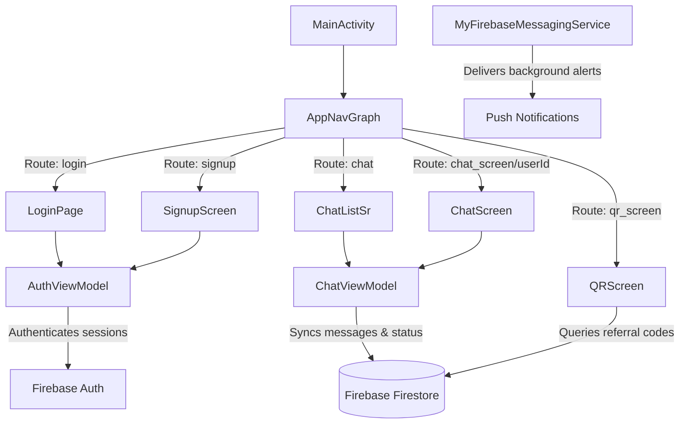

# Let's Continue 📱💬

[](https://kotlinlang.org)
[](https://developer.android.com)
[](https://firebase.google.com)
[](https://opensource.org/licenses/MIT)

**Let's Continue** is a modern, real-time messaging application for Android. Built entirely with **Jetpack Compose** following **MVVM Architecture** patterns, the app leverages the Google Firebase ecosystem to deliver seamless, secure, and instantaneous communication between users.

---

## ✨ Features

*   **Real-time Chatting**: Instantly send and receive messages with Firestore-powered real-time listeners. Includes message statuses, message feeds, and interactive chats.
*   **Presence System**: Real-time tracking of users' online/offline statuses and "last seen" timestamps integrated directly into the app lifecycle.
*   **QR Connect**: Easily connect with new friends by displaying your personal, unique QR code containing a referral token, or by scanning theirs with the built-in scanner.
*   **Firebase Authentication**: Secure email-and-password sign-up, sign-in, and session management.
*   **Push Notifications**: Integrated Firebase Cloud Messaging (FCM) that triggers system-level notifications for new incoming chat messages when the app is in the background or closed.
*   **Responsive Theme Engine**: Custom dark/light mode toggle that smoothly updates the color palette across the entire application interface.
*   **Clean MVVM Design**: Full separation of concerns using ViewModels, Compose screens, and declarative Navigation.

---

## 🛠️ Architecture & Tech Stack

### Navigation Flow & Architecture



### Core Technologies

*   **UI Framework**: [Jetpack Compose](https://developer.android.com/jetpack/compose) (Material Design 3)
*   **Language**: [Kotlin](https://kotlinlang.org)
*   **Backend Services**:
    *   **Firebase Authentication**: Secure user management.
    *   **Cloud Firestore**: Real-time database storing chat histories, connection lists, and presence indicators.
    *   **Firebase Cloud Messaging (FCM)**: Remote push notifications.
*   **Image Loading**: [Coil (Compose Extension)](https://github.com/coil-kt/coil) for loading user profile avatars asynchronously.
*   **QR Scanner/Generator**: [ZXing (Zebra Crossing) Core](https://github.com/zxing/zxing) & [ZXing Android Embedded](https://github.com/journeyapps/zxing-android-embedded).

---

## 📂 Project Structure

```
app/src/main/main/java/com/example/letscontinue/
│
├── MainActivity.kt               # Application entrypoint, requests permissions, and tracks online/offline state
│
├── navigation/
│   └── NavGraph.kt               # Configures Compose Navigation routes (Login, Signup, Chat List, Chat, QR)
│
├── screen/
│   ├── ChatSc.kt                 # Chat Detail View containing the scrolling message list and text input
│   ├── ChatlistScreen.kt         # Dashboard showing recent chat connections, online badges, and search
│   ├── Loginpage.kt              # Login screen with authentication flow validation
│   └── SignupSc.kt               # User sign-up flow requesting registration fields
│
├── ui/
│   └── theme/
│       ├── Theme.kt              # Theme setup for Light and Dark modes
│       └── chatlist/             # Common custom composables (ListItem, QRcode, ProfileAvatar, BottomNavi, Chips, etc.)
│
└── viewmodel/
    ├── AuthViewModel.kt          # Handles Firebase auth calls, registration validations, and token updates
    ├── ChatViewModel.kt          # Performs real-time firestore queries for messages and contacts
    └── MyFirebaseMessagingService.kt  # Handles registration tokens and formats incoming background notifications
```

---

## 🚀 Getting Started

### Prerequisites

*   **Android Studio** (Ladybug | 2024.2.1 or newer recommended)
*   **Android SDK Platform 36** (compileSdk/targetSdk target version)
*   **JDK 11** or newer
*   A **Firebase Project** configured for Android applications

### Installation

1.  **Clone the repository:**
    ```bash
    git clone https://github.com/bytecraft-sys/let-s-continue.git
    cd let-s-continue
    ```

2.  **Add Firebase Configuration:**
    *   Go to the [Firebase Console](https://console.firebase.google.com/).
    *   Create a new Android app within your project with the package name `com.example.letscontinue`.
    *   Download your `google-services.json` file.
    *   Place the file into the `app/` directory of the project: `/app/google-services.json`.

3.  **Configure Firebase Services:**
    *   **Authentication**: Enable *Email/Password* provider in the Firebase Authentication settings.
    *   **Firestore Database**: Initialize Firestore in *Production* or *Test* mode and ensure correct read/write permissions for logged-in users.

4.  **Build and Run:**
    *   Open the project in Android Studio.
    *   Sync Gradle files.
    *   Connect an Android emulator or a physical device (API level 24+).
    *   Click **Run** (`Shift + F10` / `Control + R`).

---

## 🔒 License

Distributed under the MIT License. See [LICENSE](https://opensource.org/licenses/MIT) for more information.